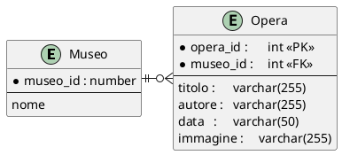

### Come scaricare un immagine

### Requisiti

Creare un importatore di opere dal json di un museo

Usare il file json [palazzo_madama.json](__materiali/palazzo_madama.json)

Creare uno script che partendo dal file json importa in un database le opere di un museo

Le immagini dovranno essere scaricate in locale.

- [ ] Creare uno script di installazione delle tabelle nel database

- [ ] 
- [ ] Creare una classe **Crud** per l'inserimento delle opere
  - [ ] dare la precedenza al metodo **create** e al metodo **readAll**  

#### Struttura del database

